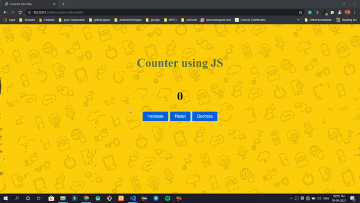
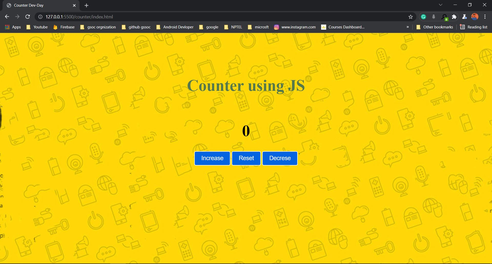
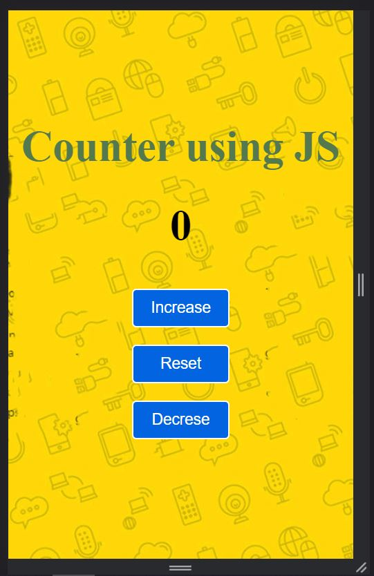

# JS Counter (Week 1)

Hello Everone, I designed `Counter` Using Vanila Javascript.

In Developr days.

## For Privew Visit this

https://dev-days-counter.netlify.com

## Demo

Demo GIF of week 1 challange counter

## Full Video
https://drive.google.com/file/d/1cUergUehNmxNd_V2pX4CJ7vMuDdtre51/view

  
## 🚀 About Me
My Name is Jay Gohel. 

I'm an Android developer and Fullsatck developer...

  
## 🔗 Links

  
## Screenshots

Web View

 

  
